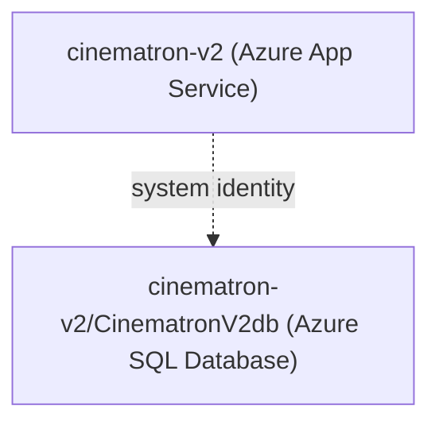

# Azure Deployment Plan for Cinematron

## Goal
Deploy the ASP.NET Core Razor Pages application to the existing Azure App Service `cinematron-v2` in resource group `CinematronV2_Resources`, subscription `1ac8cb85-c5cf-42f2-9cc8-540b8136d9ab`, using Azure CLI. Use the existing Azure SQL Database `CinematronV2db` on server `cinematron-v2`.

## Project Information
- Stack: ASP.NET Core Razor Pages, .NET 10
- Project: `Cinematron.csproj`
- Hosting: Existing Azure App Service `cinematron-v2`
- Database: Existing Azure SQL Database `CinematronV2db`
- Authentication: `Authentication=Active Directory Default`; App Service managed identity must have database access
- Schema: EF Core migrations are applied at application startup with `Database.Migrate()`

## Azure Resources Architecture

## Execution Steps
- [ ] Verify Azure CLI availability and login
- [ ] Verify the existing App Service and Azure SQL Database
- [ ] Verify or enable App Service managed identity and grant it Azure SQL database access
- [ ] Deploy the existing application to the App Service
- [ ] Confirm application startup applies EF Core migrations and creates/updates Identity tables
- [ ] Validate the deployed application
- [ ] Summarize deployment results

## Required Azure CLI Context
- Subscription: `1ac8cb85-c5cf-42f2-9cc8-540b8136d9ab`
- Resource group: `CinematronV2_Resources`
- App Service: `cinematron-v2`
- SQL server: `cinematron-v2.database.windows.net`
- SQL database: `CinematronV2db`
